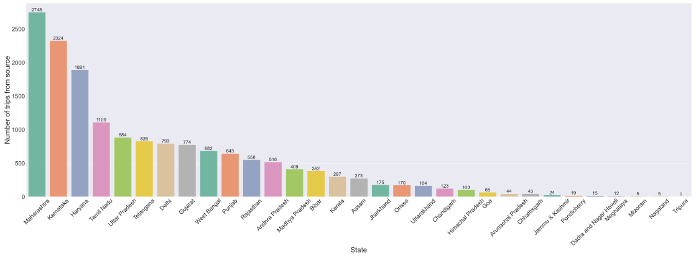
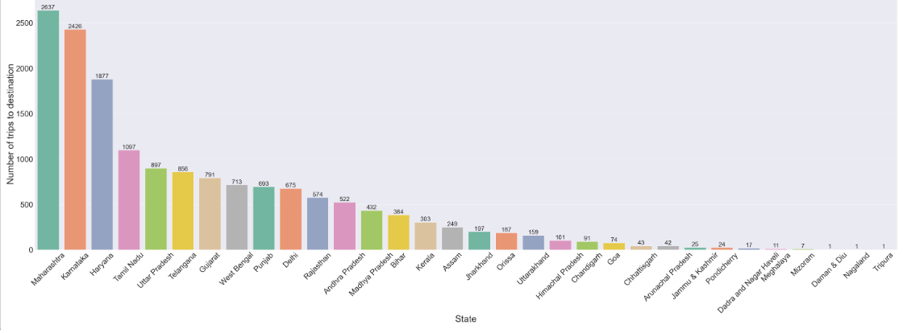
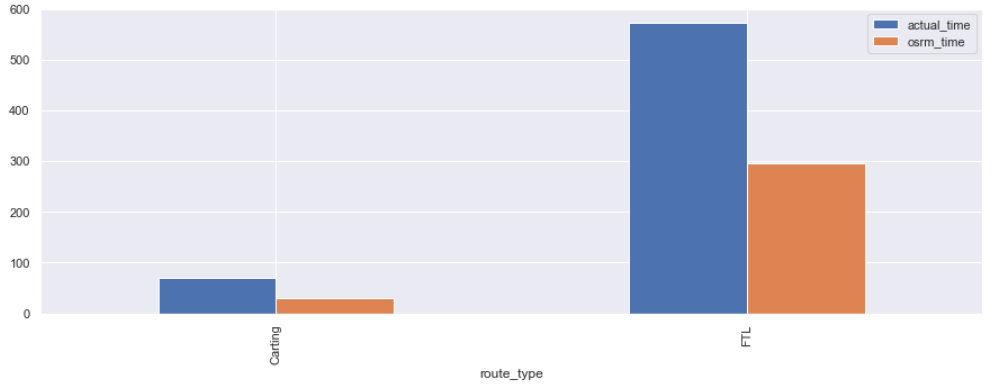
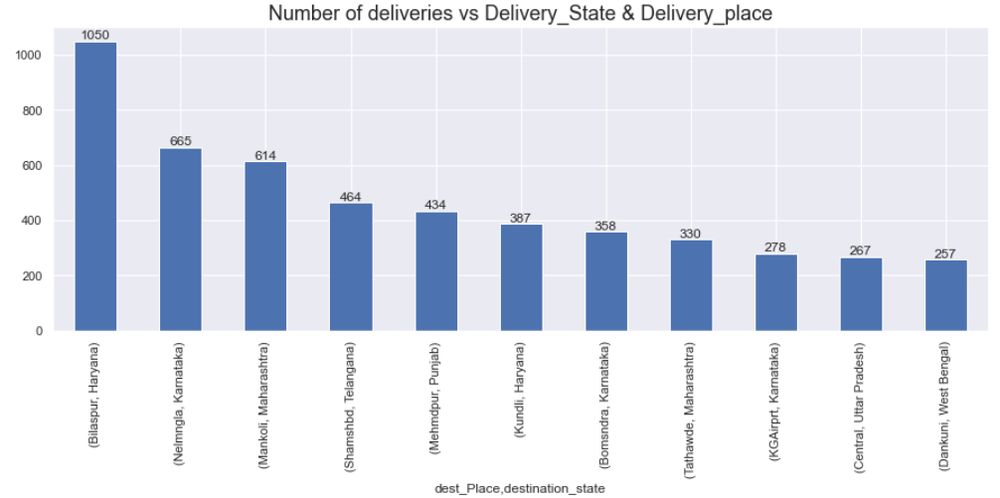
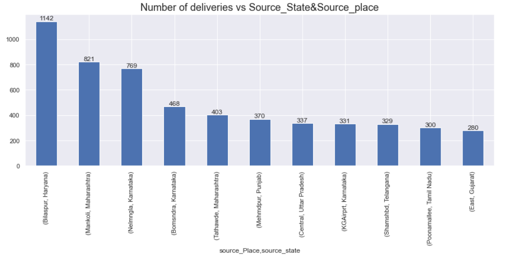
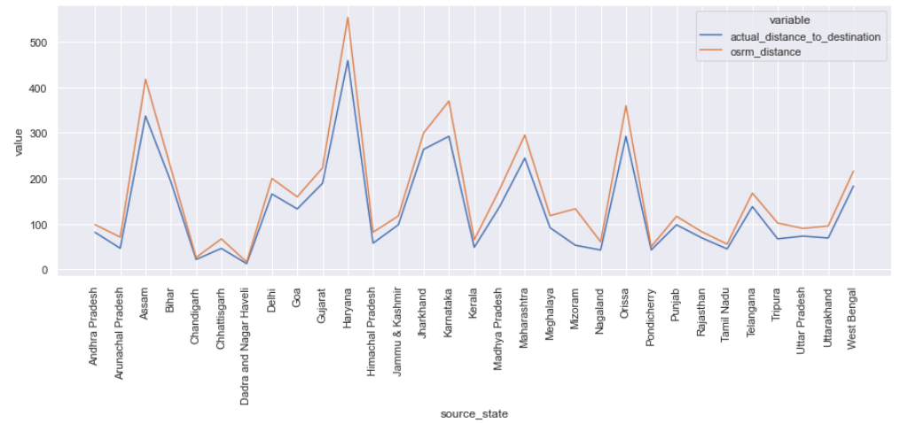
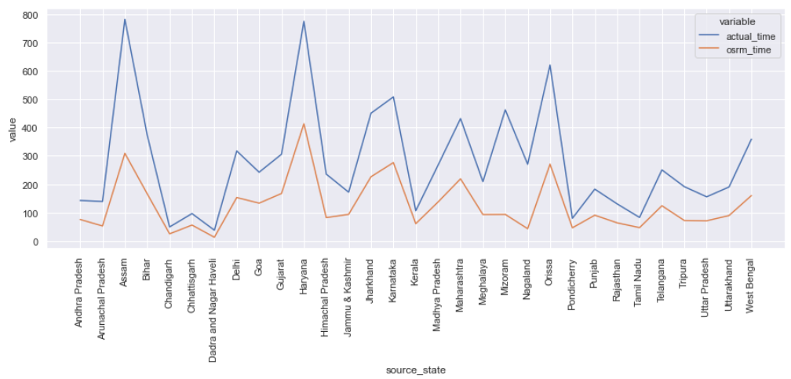
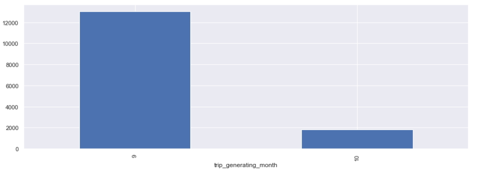
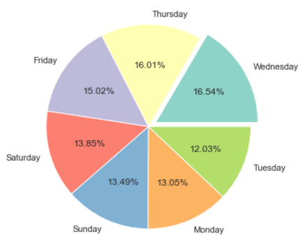

# 📦 DTDC Delivery Data Analysis

  

Welcome to the **DTDC Delivery Performance Analysis** project! This repository contains a comprehensive data analysis pipeline built in Python to evaluate and optimize the delivery network of DTDC, one of India's leading logistics companies.

## Project Description

In this project, we dive deep into delivery trip data to uncover hidden inefficiencies, regional logistics trends, and route-level performance metrics. Our goal is to help stakeholders make data-driven decisions to improve delivery accuracy, reduce delays, and boost customer satisfaction.

We work with a dataset comprising **144,867+ delivery records**, including information on trip times, source-destination pairs, route types, estimated vs actual distances, and delays.

## Business Problem
DTDC faced challenges in understanding regional delivery performance, route inefficiencies, and delay patterns across its pan-India network. There was a lack of visibility into state-wise trip volumes, delivery delays compared to estimated timelines, and seasonal demand fluctuations. This limited the company's ability to optimize resources, maintain SLA compliance, and expand into underserved regions. Through comprehensive data analysis and visual insights, this project identifies operational bottlenecks, high-demand corridors, and delay hotspots, enabling DTDC to make data-driven decisions to enhance delivery efficiency, reduce turnaround times, and improve customer satisfaction.

## Dataset Highlights

### Column Description:-

#### • data - tells whether the data is testing or training data
#### • trip_creation_time – Timestamp of trip creation
#### • route_schedule_uuid – Unique Id for a particular route schedule
#### • route_type – Transportation type
#### • FTL – Full Truck Load: FTL shipments get to the destination sooner, as the truck is making no other pickups or drop-offs along the way
#### • Carting: Handling system consisting of small vehicles (carts)
#### • trip_uuid - Unique ID given to a particular trip (A trip may include different source and destination centers)
#### • source_center - Source ID of trip origin
#### • source_name - Source Name of trip origin
#### • destination_cente – Destination ID
#### • destination_name – Destination Name
#### • od_start_time – Trip start time
#### • od_end_time – Trip end time
#### • start_scan_to_end_scan – Time taken to deliver from source to destination
#### • is_cutoff – Boolean value indicating whether cutoff time is met or not
#### • cutoff_factor – A derived metric or coefficient used to model or adjust delivery timelines based on how close an order is placed to the cutoff time. It often accounts for order processing delays or time-window compression
#### • cutoff_timestamp – Cutoff Time
#### • actual_distance_to_destination – Distance in Kms between source and destination warehouse
#### • actual_time – Actual time taken to complete the delivery (Cumulative)
#### • osrm_time – An open-source routing engine time calculator which computes the shortest path between points in a given map (Includes usual traffic, distance through major and minor roads) and gives the time (Cumulative)
#### • osrm_distance – An open-source routing engine which computes the shortest path between points in a given map (Includes usual traffic, distance through major and minor roads) (Cumulative)
#### • factor – Unknown field
#### • segment_actual_time – This is a segment time. Time taken by the subset of the package delivery
#### • segment_osrm_time – This is the OSRM segment time. Time taken by the subset of the package delivery
#### • segment_osrm_distance – This is the OSRM distance. Distance covered by subset of the package delivery
#### • segment_factor – Unknown field
---

## 🎯 Key Objectives

- Explore patterns in delivery delays and identify high-risk routes
- Compare actual vs OSRM (Open Source Routing Machine) estimates for time and distance using EDA and A/B testing
- Analyze transport mode effectiveness (Carting vs FTL)
- Uncover regional trends in delivery traffic
- Provide actionable recommendations to improve route efficiency

---

## Technologies Used

- **Python 3.x**
- **Pandas, NumPy** – Data manipulation
- **Matplotlib, Seaborn** – Data visualization
- **Jupyter Notebook** – Exploratory analysis and documentation

---

## 📈 Key Business Insights
1. Data Overview
   - Total Records Analyzed: 144,867 delivery segments
   - Transport Types:
     - Carting: Major mode of transport (visibly dominant across trips)
     - FTL (Full Truck Load): Used for long-haul, high-volume routes

2. Route Efficiency
   - Average OSRM(open-source routing engine) Estimated Time: ~66 minutes
   - Average Actual Time Taken: ~84 minutes
   - Delay Compared to Estimate: ~27% longer than the optimal time
   - This indicates inefficiencies in logistics (traffic, delays, handling).
   - Segment-wise Time:
      - Avg OSRM Segment Time: ~26 mins
      - Avg Actual Segment Time: ~37 mins
      - Efficiency Drop in Segment-Level: 42.3% increase

3. Distance Insights
  - Average Distance Travelled (Actual): 56.9 km
  - OSRM Estimated Distance: 62.3 km
  - Actual distances are ~8.7% shorter, suggesting some optimization in real-world routing.

4. State-wise Delivery Volume
  - Top 5 Source States:
    - Maharashtra
    - Karnataka
    - Haryana
    - Tamil Nadu
    - Uttar Pradesh

  

 - Top 5 Destination States:
   - Maharashtra
   - Gujarat
   - Karnataka
   - Delhi
   - Tamil Nadu

  

These states account for more than 65% of total delivery volumes.Maharashtra leads both in dispatch and receipt, indicating intra-state routing. Resource planning should factor in state-specific traffic and return load strategies.
Maharashtra and Karnataka form DTDC’s delivery heartlands.Weak penetration in northeastern states signals potential for regional growth if infrastructure allows.

5. Time Efficiency by Route Type
   - From visual comparisons:
     - FTL (Full Truck Load): Actual time is much higher than OSRM estimated time (approx. 575 vs 430)
     - Carting Deliveries are consistently closer to OSRM time predictions (deviation < 15%)
     - Carting: Lower volume but still shows actual time exceeding estimates
     - Carting Deliveries show higher deviations (avg. 20–35% longer than OSRM estimates)
     - FTL routes show more delays, possibly due to bulk handling, loading/unloading time, or highway congestion
     - Carting might be more efficient for smaller, time-sensitive loads

  

Recommendation: FTL should be prioritized for high-priority or long-distance deliveries.

6. Cut-off Performance
   - Cutoff Factor Average: ~2.5
   - This field  correlates with delay beyond scheduled scan windows
   - Suggests the importance of adjusting cutoff factor thresholds to manage SLA compliance better
---

## 🧪 A/B Testing

- Test 1: Actual Time vs OSRM Time
  - *Hypothesis:* Actual trip time is statistically different from OSRM-estimated time.
    * *Sample Size:* 14,817 trips
    * *Test:* Mann-Whitney U (Non-parametric)
    * *P-Value:* 0.00 → *Statistically significant*
  - Insight:
    - Real delivery times were *50–60% longer* than expected
    - Suggests systemic delay or inaccurate routing assumptions

- Test 2: Actual Time vs Segment Actual Time
  - *Hypothesis:* Actual trip time = sum of segment actual times
    * *Test Used:* Mann-Whitney U
    * *P-Value:* 0.00
  - Insight:
    - Segment actual times were *30% shorter* than complete trip times
    - Suggests untracked transfer, handling, or idle times during segment transitions

- Test 3: OSRM Distance vs Segment OSRM Distance
  - *Hypothesis:* OSRM-calculated trip distance = sum of segment distances
    * *Test Used:* Mann-Whitney U
    * * *P-Value:* 0.00
  - Insight:
    - Segment OSRM distances varied by *20–25%* from the full trip OSRM distance
    - Points to issues in route segmentation, potential detours, or poor data stitching

- Test 4: OSRM Time vs Segment OSRM Time
  - *Hypothesis:* OSRM total trip time = sum of segment OSRM times
    * *Test Used:* Mann-Whitney U
    * *P-Value:* 0.00
  - Insight:
    - Differences of *15–20%* were found, indicating inconsistencies in estimated segment times
    - Suggests that full-route estimates cannot rely solely on segment-level OSRM predictions

## 📊 Visual Insights

1. 

- Top destination: Bilaspur, Haryana (1050 deliveries)
- Other key destinations: Nelmangla (Karnataka), Mankoli (Maharashtra), Shamshabad (Telangana), and Medhopur (Punjab)

Business Insight:
- These hubs are critical for DTDC's network — high demand zones should be prioritized for better resource allocation
- Route bottlenecks and delays in these locations can significantly affect overall efficiency
  

2. 

- Top source: Bilaspur, Haryana (1142 deliveries) — aligns with its role as both top source and destination
- Other major origins: Mankoli (Maharashtra), Nelmangla (Karnataka), Bommsandra (Karnataka), and Tathawade (Maharashtra)

Business Insight:
- Bilaspur acts as a super-node in DTDC’s network
- These regions might need capacity upgrades or better tracking systems to manage inflow-outflow efficiently
  

3. 

-Many states (e.g., Haryana, Assam, Orissa) show significantly higher actual distances than OSRM estimates.

Business Insight:
- Route deviations or unoptimized paths increase delivery distance
- Real-world delivery paths often differ due to toll avoidance, road conditions, or vehicle restrictions

4. 

- Widespread delay observed: actual times consistently exceed OSRM expectations
- States like Assam, Haryana, and Orissa show the highest time discrepancies

Business Insight:
- Consistent delays across the network hint at infrastructure issues, operational inefficiencies, or inaccurate OSRM calibration
- Delay mitigation strategies should be state-specific and data-informed

5. 

- September (Month 9) accounts for ~87% of all trips; October (Month 10) only ~13%

Business Insight:
- There’s a heavy seasonal surge in deliveries during September — possibly linked to festivals, e-commerce sales, or fiscal cycle
- DTDC should prepare with seasonal workforce, vehicle availability, and inventory planning for Q3 peaks

6. 

- Mid-Week Spike in Orders: Wednesday (16.54%) and Thursday (16.01%) have the highest order volumes
  - Indicates strong customer activity mid-week, possibly due to routine purchases, salary-week effects, or business restocking cycles
- End-of-Week Strength: Friday (15.02%) also shows strong order volume, possibly people preparing for the weekend
- Weekend Dip (Slight): Saturday (13.85%) and Sunday (13.49%) see slightly lower order rates compared to weekdays
  - Could be due to relaxation periods, lower B2B activity, or delivery slowdowns
- Beginning of Week Is Weakest: Monday (13.05%) and especially Tuesday (12.03%) show the lowest number of orders
  - May reflect delayed decision-making after weekends or lower purchase intent early in the week
 

## Overall outcomes and Recommendations:

 1. Optimize Operations in Key Hubs
Observation: Locations like Bilaspur (Haryana), Mankoli (Maharashtra), and Nelmangla (Karnataka) dominate both as source and destination hubs.

 Recommendation:
   - Invest in expanding infrastructure and manpower at these critical nodes
   - Implement automated sorting and tracking systems to manage high volumes efficiently
   - Monitor these hubs for early identification of delays or operational bottlenecks

 2. Align Resource Planning with Weekday Patterns
Observation: Delivery volumes peak mid-week (Wed–Thu: >32.5%) and are lowest on Tuesdays (12%)

 Recommendation:
   - Allocate more delivery staff, vehicles, and support resources mid-week to meet demand
   - Use off-peak days (Tuesdays, weekends) for route testing, training, or maintenance activities

 3. Plan for Seasonal Demand Surges
Observation: ~87% of trips occur in September, indicating strong seasonal spikes

 Recommendation:
   - Prepare a seasonal staffing and fleet augmentation plan for Q3
   - Pre-position inventory in high-demand zones in August for proactive delivery

 4. Minimize Actual vs OSRM Time and Distance Gaps
Observation: Actual delivery times and distances are consistently higher than OSRM estimates across most states

 Recommendation:
   - Conduct route audits and update mapping tools with real-time road intelligence
   - Use AI-driven route optimization software that factors in traffic, roadblocks, and toll routes
   - Partner with local logistics partners in high-deviation regions (e.g., Assam, Haryana)

 5. Improve Full-Truckload (FTL) Efficiency
Observation: FTL routes show major delays compared to planned OSRM time (by over 25–30%)

 Recommendation:
   - Implement better loading/unloading protocols and monitor dwell times
   - Consider breaking FTLs into smaller shipments (LTL) where FTL is causing time loss
   - Track FTL routes with GPS and geofencing to ensure schedule adherence

 6. Expand in Low-Penetration States
Observation: States like Tripura, Mizoram, and Nagaland have negligible delivery volumes (<10 trips)

 Recommendation:
   - Evaluate strategic partnerships or franchise models to expand reach in underserved regions
   - Introduce incentivized delivery models or micro-warehousing to boost market entry

 7. Define and Improve SLA Compliance
Observation: Significant deviation from planned time metrics can impact SLA commitments

 Recommendation:
   - Establish clear SLA definitions for different route types (FTL, carting)
   - Monitor SLA compliance rates by route, state, and mode, and flag underperforming lanes

 8. Balance Source-Destination Network Load
Observation: Delivery loads are heavy in Maharashtra and Karnataka both inbound and outbound

 Recommendation:
   - Use reverse logistics strategies to optimize truck utilization on return routes
   - Balance distribution load by exploring secondary hubs in adjacent states (e.g., Gujarat, MP)

---

##  Conclusion

The DTDC delivery analysis reveals key operational patterns, regional dependencies, and performance gaps. High-volume hubs like Bilaspur, Mankoli, and Nelmangla are central to the network and demand enhanced infrastructure and resource allocation. Delivery volumes peak mid-week and in September, indicating the need for dynamic staffing and seasonal planning. Significant discrepancies between planned (OSRM) and actual delivery times/distances highlight the need for better route optimization and SLA monitoring. Lastly, low delivery activity in northeastern and smaller states presents expansion opportunities. Overall, a data-driven strategy can enhance service efficiency, reduce delays, and improve customer satisfaction across the network.

## Contact

For questions or collaboration inquiries, feel free to reach out via [dwaipayan.saha1997@gmail.com](dwaipayan.saha1997@gmail.com) or [Linkedin](https://www.linkedin.com/in/dwaipayan-s-9080a689/)

