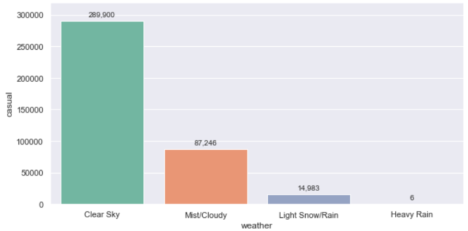
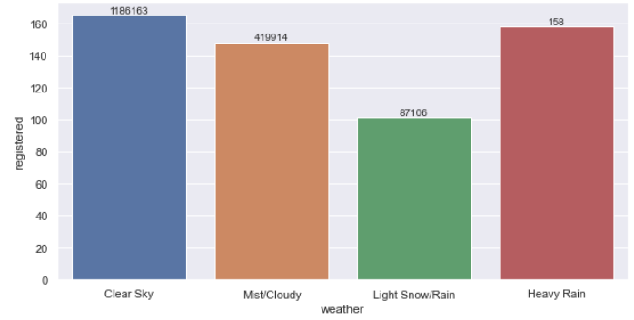

# 🚲 GoBike Rental Analysis

---

## Project Overview
GoBike Rental Analysis is a data-driven project aimed at understanding how different factors influence the usage of a bike-sharing system over time. Using real-world rental data collected on daily and hourly basis, this analysis helps identify usage patterns that can inform **business strategies**, **operational improvements**, and **customer engagement efforts**.EDA and statistical tests are performed which aimed at understanding how different factors influence the usage of a bike-sharing system over time. 

## Objective of the analysis
Bike-sharing systems have become a key component of urban mobility. Operators need to understand:
- When and why people use shared bikes?
- How usage differs between casual users and subscribers?
- The impact of weather, time, and holidays on demand?
- How to optimize availability and staffing for peak usage?

This project addresses these needs through **data exploration**, **visual storytelling**, and **statistical hypothesis testing**.

## What This Project Includes
- **Exploratory Data Analysis (EDA)** to examine rental trends over time (hour, day, season)
- **Segmented analysis** of two user types: **casual** (non-subscribers) and **registered** (subscribers)
- **Visualization of seasonal, monthly, and hourly usage** to identify high-demand periods
- **Correlation analysis** between rental volume and weather-related variables (temperature, humidity, etc.)
- **Statistical testing** (Shapiro-Wilk, t-tests, ANOVA) to validate key assumptions
---

## Insights and Analysis

1. Seeasonwise count analysis

   
   

   Business Insights:
    - Casual Users: Highest in Summer (81,978 in 2012) and Fall (80,682) and lowest in Spring (27,911) and Winter (45,747)
    - Registered Users: Highest in Fall (304,732) and Winter (286,693) and lowest in Spring (189,456) and Summer (286,298)
    - Usage is more balanced across seasons, unlike casuals
    - Casual users rely on pleasant weather and daylight (Summer, Fall)
    - Registered users ride consistently year-round, suggesting use for daily commuting

   Recommendations:
    - Increase fleet size in summer/fall to meet casual demand
    - Provide seasonal passes or loyalty rewards for registered users
    - Consider season-specific insurance, accessories, and safety campaigns
      
2. Year and Month wise count Analysis

   
   

   Business Insights:
    - Casual Users:
      - Sharp increase from March to peak in June to August, then a decline
      - April to September show the highest casual activity
      - Casual rentals in 2012 were significantly higher than 2011 across all months
    - Registered Users:
      - High and stable usage throughout the year
      - June to October are top-performing months, each crossing ~100,000 rides in 2012
      - Registered users doubled from 2011 to 2012 in many months
    - Casual usage is seasonal and leisure-driven
    - Registered usage is stable, habitual, and commute-driven

   Recommendations:
    - Launch tourist/short-term promotions between April and September
    - Offer discounted monthly subscriptions in early spring to convert casual to registered users
    - Scale up bike and station availability in summer months
    - Reinforce bike maintenance and inspection processes in June–August
      
3. Weather wise count Analysis

   
   


   


## 📁 Files

- `GoBike_Rent_Analysis.ipynb`: Main Jupyter notebook with code, plots, and statistical analysis.
- `GoBike_sharing_dataset.csv`: Dataset containing hourly bike rental information.
- Output plots (generated upon execution):
  - `rentals_by_season.png`
  - `monthly_avg_rentals.png`
  - `hourly_trend_users.png`
  - `correlation_heatmap.png`

---

## 📊 Dataset Overview

| Column       | Description                                             |
|--------------|---------------------------------------------------------|
| `datetime`   | Timestamp of the observation                            |
| `season`     | 1: Winter, 2: Spring, 3: Summer, 4: Fall                 |
| `holiday`    | 1 if the day is a holiday, otherwise 0                  |
| `workingday` | 1 if the day is a working day, otherwise 0              |
| `weather`    | 1 to 4, from clear to heavy rain/storm                  |
| `temp`       | Normalized temperature in Celsius                       |
| `atemp`      | "Feels like" temperature                                |
| `humidity`   | Relative humidity (%)                                   |
| `windspeed`  | Wind speed                                              |
| `casual`     | Number of non-registered user rentals                   |
| `registered` | Number of registered user rentals                       |
| `count`      | Total rentals (casual + registered)                     |

---

## 🧪 Methodology

### 🧹 Data Preprocessing
- Converted `datetime` into `hour`, `month`, `weekday`, and `year` features
- Checked for nulls and data types

### 📈 Visualizations
- **Boxplots** for seasonal variation
- **Line plots** for monthly and hourly trends
- **Heatmaps** for correlation analysis

### 🔬 Statistical Analysis
- **Shapiro-Wilk test** for normality
- **T-test**: Compared rental counts on working vs. non-working days
- **ANOVA**: Analyzed rental variation across seasons

---

## 🔍 Key Insights

| Factor         | Insight                                                                 |
|----------------|-------------------------------------------------------------------------|
| **Season**     | Summer (season 3) has the highest rentals; winter (season 1) the lowest |
| **Working Days** | Rentals significantly higher on working days (via t-test)              |
| **User Types** | Registered users dominate weekdays; casuals peak on weekends            |
| **Hourly Use** | Morning (7–9 AM) and evening (4–7 PM) peaks for commuters               |
| **Weather**    | Rentals drop in bad weather, high humidity, and low temperature         |
| **Temperature**| Positively correlated with rentals                                       |

---

## 📦 How to Run

1. Open `GoBike_Rent_Analysis.ipynb` in Jupyter Notebook
2. Ensure `GoBike_sharing_dataset.csv` is in the same directory
3. Run all cells to generate plots and perform analysis

---

## 📚 Dependencies

Install via pip:
```bash
pip install pandas matplotlib seaborn scipy

