# 🚲 GoBike Rental Analysis
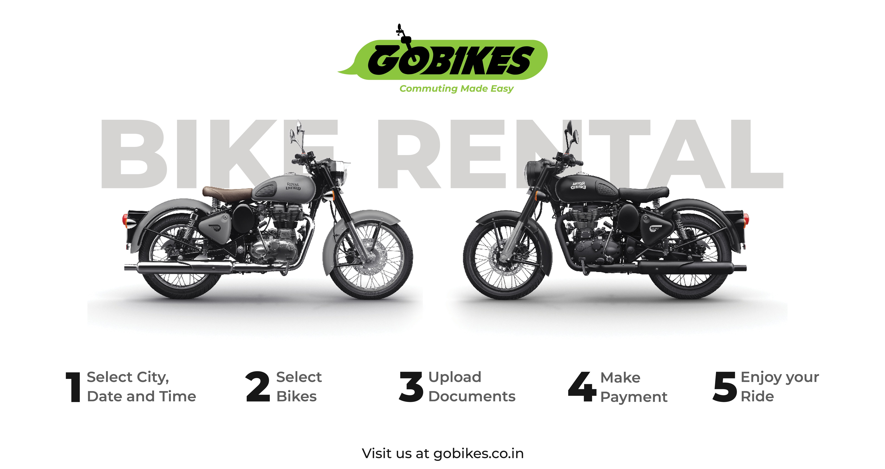
---

## Project Overview
GoBike Rental Analysis is a data-driven project aimed at understanding how different factors influence the usage of a bike-sharing system over time. Using real-world rental data collected on daily and hourly basis, this analysis helps identify usage patterns that can inform **business strategies**, **operational improvements**, and **customer engagement efforts**.EDA and statistical tests are performed which aimed at understanding how different factors influence the usage of a bike-sharing system over time. 

## 📊 Dataset Overview

| Column       | Description                                             |
|--------------|---------------------------------------------------------|
| `datetime`   | Timestamp of the observation                            |
| `season`     | 1: Winter, 2: Spring, 3: Summer, 4: Fall                |
| `holiday`    | 1 if the day is a holiday, otherwise 0                  |
| `workingday` | 1 if the day is a working day, otherwise 0              |
| `weather`    | 1 to 4, from clear to heavy rain/storm                  |
| `temp`       | Normalized temperature in Celsius                       |
| `atemp`      | "Feels like" temperature                                |
| `humidity`   | Relative humidity (%)                                   |
| `windspeed`  | Wind speed                                              |
| `casual`     | Number of non-registered user rentals                   |
| `registered` | Number of registered user rentals                       |
| `count`      | Total rentals (casual + registered)                     |

## Objective of the analysis
Bike-sharing systems have become a key component of urban mobility. Operators need to understand:
- When and why people use shared bikes?
- How usage differs between casual users and subscribers?
- The impact of weather, time, and holidays on demand?
- How to optimize availability and staffing for peak usage?

This project addresses these needs through **data exploration**, **visual storytelling**, and **statistical hypothesis testing**.

## What This Project Includes
- **Exploratory Data Analysis (EDA)** to examine rental trends over time (hour, day, season)
- **Segmented analysis** of two user types: **casual** (non-subscribers) and **registered** (subscribers)
- **Visualization of seasonal, monthly, and hourly usage** to identify high-demand periods
- **Correlation analysis** between rental volume and weather-related variables (temperature, humidity, etc.)
- **Statistical testing** (Shapiro-Wilk, t-tests, ANOVA) to validate key assumptions
---

## Insights and Analysis

1. **Seasonwise count analysis**
   
  - Registered Users 
   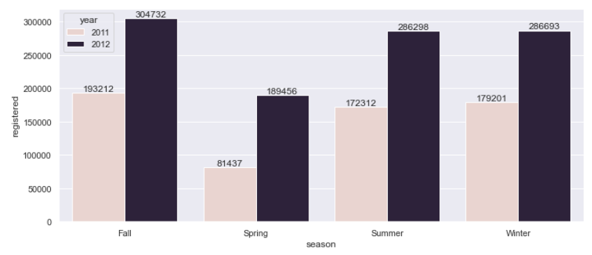 

  - Casual users 
   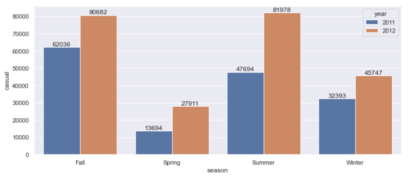

  - Business Insights:
    - Casual Users: Highest in Summer (81,978 in 2012) and Fall (80,682) and lowest in Spring (27,911) and Winter (45,747)
    - Registered Users: Highest in Fall (304,732) and Winter (286,693) and lowest in Spring (189,456) and Summer (286,298)
    - Usage is more balanced across seasons, unlike casuals
    - Casual users rely on pleasant weather and daylight (Summer, Fall)
    - Registered users ride consistently year-round, suggesting use for daily commuting

  - Recommendations:
    - Increase fleet size in summer/fall to meet casual demand
    - Provide seasonal passes or loyalty rewards for registered users
    - Consider season-specific insurance, accessories, and safety campaigns
      
2. **Year and Month wise count Analysis**

  - Registered Users 
   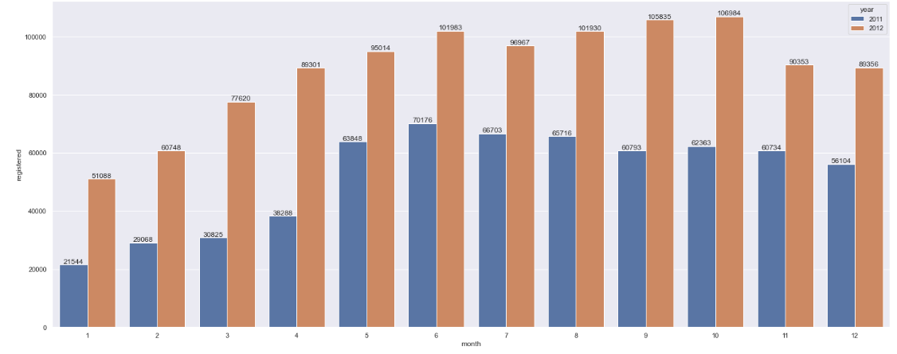 
   
  - Casual user
   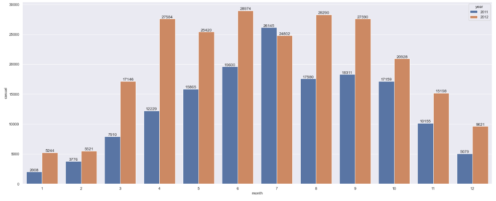

  - Business Insights:
    - Casual Users:
      - Sharp increase from March to peak in June to August, then a decline
      - April to September show the highest casual activity
      - Casual rentals in 2012 were significantly higher than 2011 across all months
    - Registered Users:
      - High and stable usage throughout the year
      - June to October are top-performing months, each crossing ~100,000 rides in 2012
      - Registered users doubled from 2011 to 2012 in many months
    - Casual usage is seasonal and leisure-driven
    - Registered usage is stable, habitual, and commute-driven

  - Recommendations:
    - Launch tourist/short-term promotions between April and September
    - Offer discounted monthly subscriptions in early spring to convert casual to registered users
    - Scale up bike and station availability in summer months
    - Reinforce bike maintenance and inspection processes in June–August
      
3. **Weather wise count Analysis**

  - Registered Users 
   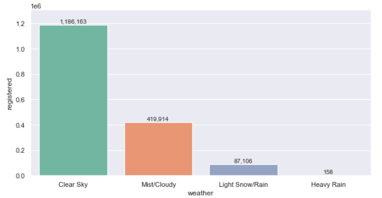 

  - Casual Users 
   

  - Business Insights:
    - Casual Users rides drop drastically in bad weather: from 1.18M in clear sky to 158 in heavy rain
    - Less impacted than casual users, but still decline with poor weather

  - Recommendations:
    - Implement weather-sensitive pricing or pause policies
    - Display real-time weather alerts in app
    - Offer co-promotions with public transport during bad weather

4. **Weekday vs WorkingDay count analysis**

   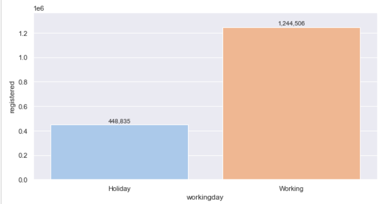

  - Business Insights:
    - Registered Users strongly prefer for working days — commuting trend
    - Casual Users strongly prefer higher usage on holidays/weekends — leisure behavior

  - Recommendations:
    - Target registered users with weekday perks (e.g., partner coffee shops)
    - Weekend/holiday discounted ride passes for casual users
    - Shift more bikes to tourist hubs on weekends

5. **Outlier Analysis**

   Based on numerical features analysis:

   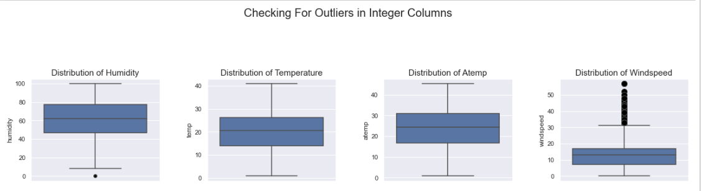

  - Business Insights:
   - Humidity
      - Distribution: Fairly wide, ranging from ~0 to ~100%
      - Outliers: A few outliers present at the low end (around 0–10%)
      - Most humidity readings are within a reasonable range (around 40%–90%)
      - Very low humidity levels are rare and could represent sensor errors or unusual weather conditions

   - Temperature (temp)
      - Distribution: Uniform spread from ~0°C to ~40°C
      - Outliers: None
      - Wide range indicates seasonality effects (winter to summer)

   - Windspeed
      - Distribution: Most values between 0–30 km/h, but several high-value outliers (~50+)
      - Outliers: Many extreme values
      - Wind speed shows significant outliers, possibly due to storms or data recording issues
      - Investigate whether these outliers are valid
        
  - Recommendations:
    - Monitor weather conditions—particularly wind—for adjusting supply/demand forecasting or pricing

   **Based on categorical features analysis:**

   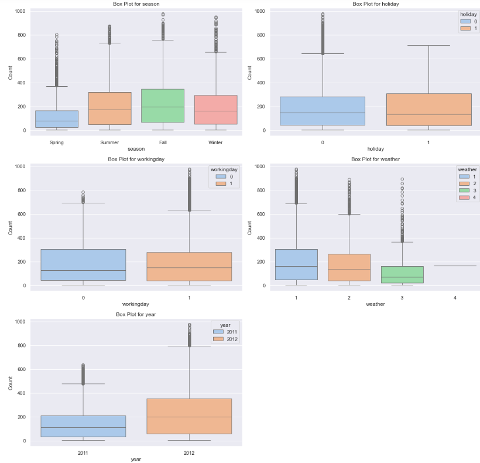

  - Business Insights:
     - Season
       - Median rental counts are highest in Summer and Fall, followed by Spring and Winter
       - Summer & Fall have higher upper whiskers and more frequent high-rental days
       - Demand is highest in Summer and Fall
       - Marketing, inventory, and operational planning should focus on these peak seasons
       - Winter has lowest variability, suggesting more consistent (but lower) usage

    - Holiday
      - Median rentals on non-holidays (0) are higher than holidays
      - Holidays show lower distribution and fewer outliers on the higher end
      - Bike demand drops during holidays, possibly due to fewer commuters or people traveling out of town
      - Business should not over-allocate bikes on holidays and focus on leisure segments

    - Working Day
      - Slightly higher median rentals on working days
      - More consistent demand and high-rental outliers on working days
      - Working days have higher and more stable demand, supporting the idea that people commute using bikes
      - Promotions targeting commuters (office-goers) are strategic
       
    - Weather
      - Best demand on weather=1 (Clear/Fair) days
      - Steep drop for weather=2 (Mist/Cloudy) days
      - Rentals are very low for weather=3 (Light Rain/Snow) and nearly absent for weather=4 (Heavy Rain)
      - Weather is a major driver of rental behavior
      - Rentals drop >50% on rainy/snowy days
      - Dynamic pricing or offering discounts on light rain days
      - Overstocking bikes during predicted bad weather should be avoided

    - Year
      - Median rentals in 2012 are significantly higher than 2011
      - More high-rental outliers in 2012
      - Business grew strongly in 2012—demand increased

6. **Categorising numerical inputs and counting users based on the numerical inputs**

   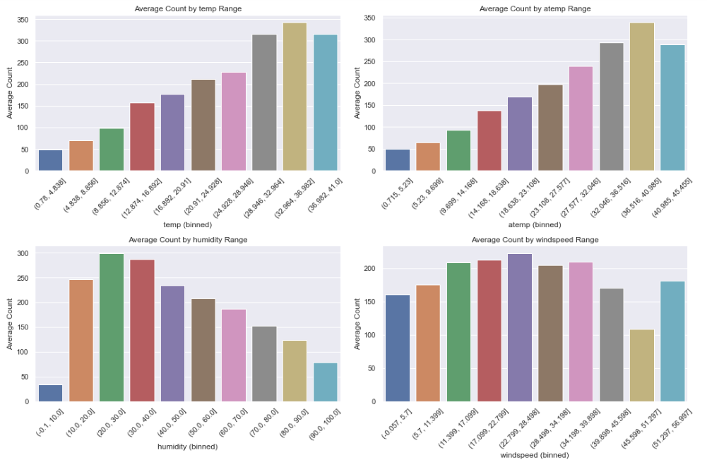

   - Detailed Insights:
   - Average Count by Temperature Range
       - There's a clear positive correlation between temperature and the average count. As temperatures increase, the average count also steadily increases. The highest average counts are observed in the warmer temperature ranges, specifically around 28-42°C for temp and 32-46°C for atemp
       - Expect the highest demand or activity during warmer periods. This is critical for resource allocation (e.g., staffing, inventory, vehicle availability for a service like bike rentals)
       - Warm weather is an ideal time for promotions and marketing campaigns to capitalize on the higher natural demand
       - Ensure that services are fully operational and well-maintained in anticipation of peak demand during these warmer months
       - India experiences significant variations in temperature. Knowing these optimal ranges helps target specific seasons or regions for increased focus
         
   - Average Count by Humidity Range:
       - The average count peaks at moderate humidity levels (specifically, the 20.0-30.0% and 30.0-40.0% ranges), where it reaches the highest levels. As humidity either drops very low (below 10%) or rises significantly above 40-50%, the average count tends to decrease
       - Users seem most active or comfortable when humidity is moderate. Very dry or very humid conditions affect usage

   - Average Count by Windspeed Range:
       - The average count appears to be relatively high across a broad range of moderate wind speeds (approximately 11.399 to 34.198 mph), with the highest counts observed around 17.099 to 28.498 mph. However, very low wind speeds (below 5-7 mph) and very high wind speeds (above 40 mph) show a decrease in the average count
       - Users prefer moderate wind conditions rather than completely still or excessively windy conditions. Very strong winds clearly act as a deterrent
       - For outdoor services, high wind speeds can be a safety concern or simply uncomfortable, leading to reduced engagement
       - If relevant, providing real-time wind speed information could help users plan their activities or choose appropriate times
       - If high winds are frequent, explore strategies to make the service more appealing or safer (e.g.,offering wind-resistant gear)

   - Overall Business Recommendations:
     - Dynamic Resource Management: Use these insights to implement dynamic resource allocation. For example, increase staff, inventory, or operational hours during periods of optimal temperature, moderate humidity, and moderate wind speeds. Reduce resources during adverse conditions
     - Run promotions and targeted ads specifically during favorable weather conditions
     - Offer incentives or alternative solutions during unfavorable weather to maintain engagemen
     - Since service is weather-dependent, consider integrating real-time weather forecasts into your customer-facing platforms
     - Strategic Planning: Use these insights for long-term strategic planning, such as determining the best seasons for major product launches, expansions, or maintenance activities

7. **Scatterplots between dependent and independent variables**

 - In all scatter plots (Humidity, Windspeed, Temperature), Registered Users consistently outnumber Casual Users across the vast majority of the data points. This suggests a strong core user base.

   - Temperature vs Count of users
      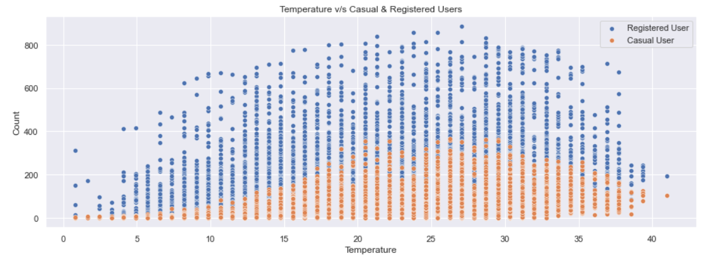

   - Optimal Range: The highest number of users are observed when temperatures are approximately between 15°C and 30°C (or roughly 60°F to 85°F). This represents comfortable outdoor temperatures
   - Impact of Extreme Temperatures: Both very cold (below 10°C) and very hot (above 35°C) temperatures lead to a significant decrease in user activity
   - This is a crucial factor. Marketing campaigns and service availability should align with favorable temperature ranges. For example, offer discounts or special promotions during periods of optimal temperatures to maximize usage. During extreme temperatures, focus on retention strategies or alternative services if available

   - Humidity vs Count of users
     
      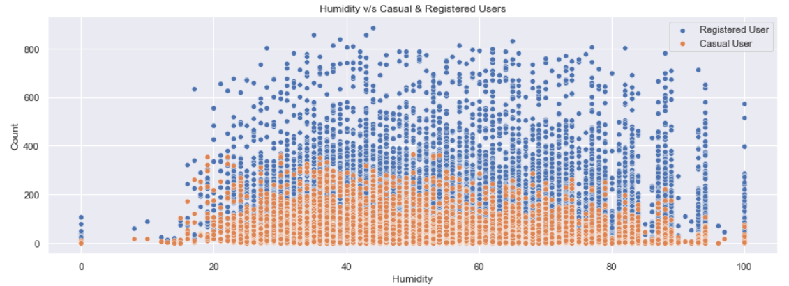
     
   - Optimal Range: The highest number of users (both registered and casual) are observed when humidity is roughly between 20% and 70%
   - Impact of Extreme Humidity:User counts significantly drop when humidity is very low (below 10-20%) or very high (above 80%). This is particularly noticeable for both registered and casual users
   - If the service is outdoor-related (e.g., bike sharing), understanding optimal humidity levels can help in resource allocation and marketing efforts. For instance, more bikes/resources might be needed on days with moderate humidity. Promotions could be targeted during these periods

   - Wndspeed vs Count of users
      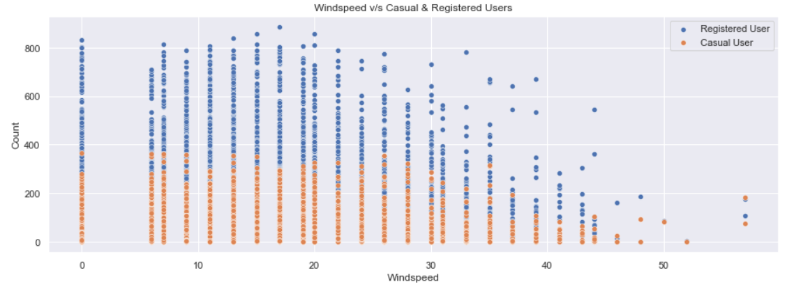

   - Optimal Range: User activity is generally higher at lower wind speeds, peaking around 10-20 mph
   - As wind speed increases beyond 20-25 mph, user counts, especially for casual users, show a noticeable decline. At very high wind speeds (above 40 mph), usage is minimal
   - High winds affects usage. If the service involves physical activity outdoors, consider weather alerts or alternative indoor options/promotions during high wind conditions. This information can also inform safety guidelines if applicable

## 🧪 A/B Testing and Statistical summaries

📌 Hypothesis 1: Rentals are higher on working days than holidays
      - Test Used: Mann Whitney - U test
      - Groups Compared: workingday = 1 vs workingday = 0
      - p-value: < 0.001
      - Insight: Rentals are significantly higher on working days, mainly due to commuter (registered) users
      
   - Business Action:
      - Focus weekday marketing on office commuters
      - Ensure bike availability and rebalancing during weekday peaks
      - Use holiday ride bundles to engage casual users on low-demand days

📌 Hypothesis 2: To test No. of bikes rented similar or different in different seasons
      - Test Used: Kruskal Wallis Test, Dunn Test
      - p-value: < 0.0001
      - Insight: Registered users dominate usage and represent long-term revenue
          - Groups which differ are: Fall VS Spring, Fall VS Summer, Fall VS Winter, Sring VS Summer, Spring VS Winter

   - Business Action:
      - Increase the number of bikes and docking stations in high-demand seasons (e.g., summer/fall), and reduce inventory in low-demand seasons (e.g., winter)
      - Offer discounted rides or subscription bundles in low seasons (e.g., winter) to stimulate usage
      - Charge premium rates or introduce surge pricing in high-demand seasons
      - During winter, provide weather-resistant bikes or promote shorter trips with bundled passes
      - Introduce season-specific passes (e.g., summer-only commuter pass) for occasional or tourist users

📌 Hypothesis 3: Weather conditions affect rental count
      - Test Used: Kruskal Wallis Test, Dunn Test
      - Weather Categories: Clear sky, Mist/Cloudy, Light Rain/Snow, Heavy Rain
      - p-value: < 0.001
      - Insight: Poor weather significantly reduces rentals, especially among casual users.

   - Business Action:
      - Apply weather-aware dynamic pricing
      - Notify users of poor conditions and promote indoor partner perks

## Feature Selection

- Feature selection is the process of identifying and selecting the most relevant input variables (features) that contribute most to predicting the target variable in a machine learning model.
  
**Why Feature Selection Matters:**
   - Improves model accuracy by removing noisy or irrelevant data
   - Reduces training time and computational cost
   - Enhances interpretability of the model
   - Prevents overfitting by avoiding unnecessary complexity.

Here also we have performed feature selection process to select the most appropriate features for predicting the rental count. The used techniques are
   - Extra Trees Classifier
   - Correlation Analysis
   - Information Gain
   - Univariate Analysis

Top 5 most important features (highest ➡️ lowest importance)
Insights:
 - Based on Extra Trees Classifier = windspeed, humidity, atemp, temp, month
 - Based on Information Gain = weather, workingday, atemp, temp, month
 - Based on Univariate Analysis = humidity,temp, atemp, windspeed, month
---

## Conclusion

The GoBike user behavior analysis reveals clear difference between user types, seasonal trends, and external influencing factors. Registered users, who primarily use the service for commuting, show consistent ridership throughout the year, with noticeable peaks on working days. In contrast, casual users are more active during holidays and warmer months, particularly in summer and fall, indicating leisure-based usage.

Seasonal analysis confirms that ridership varies significantly across the year, with the highest usage in summer and fall and the lowest during winter. Weather also plays a critical role—clear skies and moderate temperatures drive the most rentals, while heavy rain and snow cause a steep decline in usage, especially among casual riders.

These behavioral patterns were validated through statistical hypothesis testing. T-tests and ANOVA confirmed that the differences in rentals by day type, user category, and weather condition are statistically significant and not due to random variation.

From a business perspective, GoBike can leverage these insights to improve performance and customer satisfaction. Strategies such as commuter-focused weekday promotions, seasonal marketing campaigns for casual riders, and dynamic fleet allocation based on weather and seasonal forecasts can significantly enhance operations and profitability.

## Contact
For questions or collaboration inquiries, feel free to reach out via [dwaipayan.saha1997@gmail.com](dwaipayan.saha1997@gmail.com) or [Linkedin](https://www.linkedin.com/in/dwaipayan-s-9080a689/)
