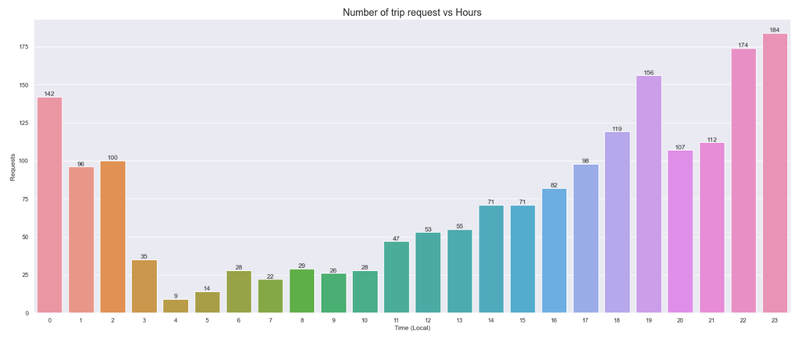
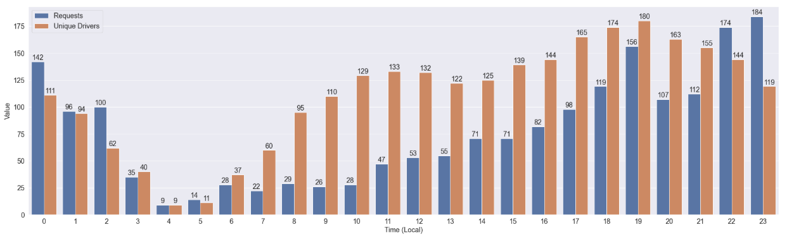
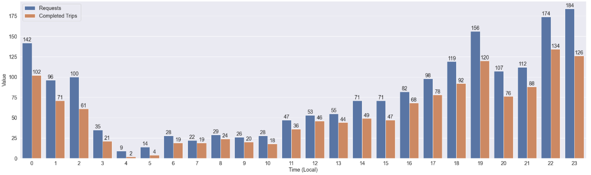
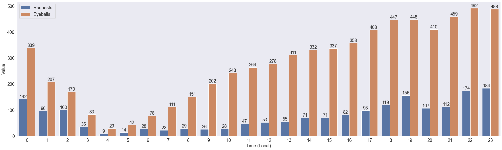
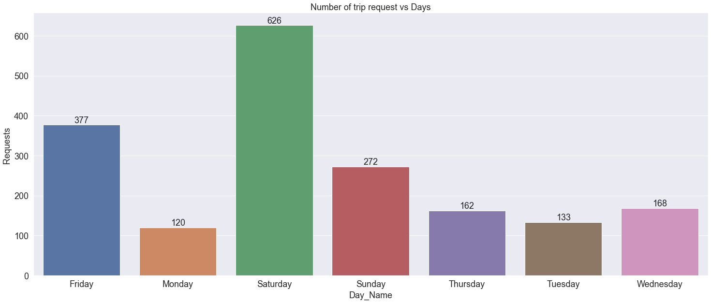
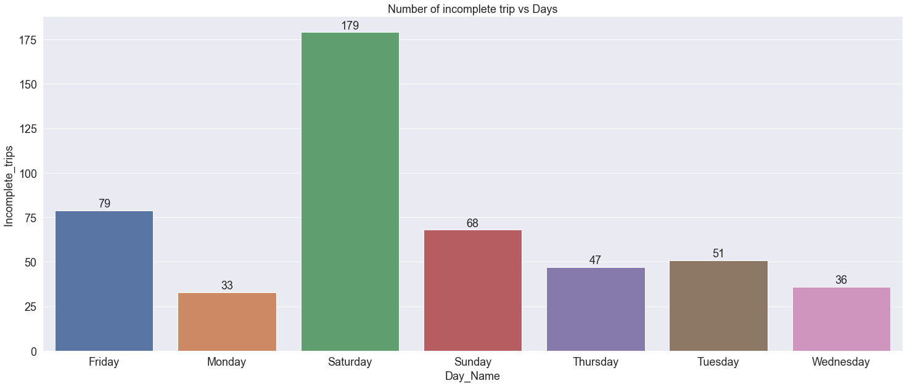
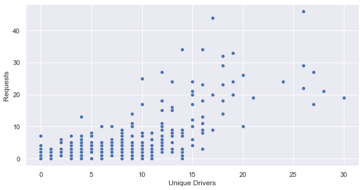

# 🚗 OLA Ride Analysis

## Business Problem
OLA operates a ride-hailing platform where understanding ride demand fluctuations is key to ensuring service efficiency, driver availability, and customer satisfaction. The dataset includes ride counts across different months, times of day, and locations, highlighting trends and patterns in user booking behavior.The business questions answered are, how can OLA improve operational efficiency and revenue by identifying the key temporal and spatial patterns that drive ride demand in metropolitan areas?

## Project Overview
The OLA Ride Analysis project is a data-driven initiative focused on optimizing ride-sharing operations through comprehensive analysis of historical usage patterns. In today’s fast-paced urban mobility landscape, understanding user behavior, driver dynamics, and operational efficiency is critical for delivering timely, reliable, and cost-effective transport services. This project addresses these challenges by dissecting key aspects of the OLA platform’s ride data at an hourly resolution.

## Dataset Overview

The core dataset captures user interactions and driver activities over a series of time intervals, providing a granular view of how the ride-sharing ecosystem behaves across different hours of the day. By examining variables such as the number of users who opened the app (Eyeballs), number of ride requests, trip completions, and availability of drivers, the analysis uncovers systemic gaps and opportunities for strategic improvement.

| Column            | Description                                      |
| ----------------- | ------------------------------------------------ |
| `Time (Local)`    | The hour of the day (0 to 23)                    |
| `Eyeballs`        | Number of users who opened the OLA app           |
| `Zeroes`          | Number of users who didn’t see any available car |
| `Requests`        | Number of ride requests made                     |
| `Completed Trips` | Number of rides successfully completed           |
| `Unique Drivers`  | Number of drivers logged in during that hour     |

This project serves multiple use cases for stakeholders including:
  - Operations teams, to optimize supply planning
  - Product teams, to improve app engagement and reduce abandonment
  - Marketing teams, to identify drop-off points and personalize offers
  - Drivers, to increase earning potential through better timing and positioning

## Insights and Analytics

1. 

- Business Insights:
  - Strong evening and late-night demand – indicative of work returns, events, and nightlife **(11 PM (23:00): 184 requests, 7 PM (19:00): 156 requests)**
  - **5 PM to 2 AM** shows a consistent volume between 96–112 requests
  - Early night hours still show significant demand, requiring continued driver availability
  - **4 AM (9 requests)** and **5 AM (14 requests)** mark the lowest activity
  - Indicates low operational urgency but potential for targeted niche service (e.g., airport rides)
  - From **9 AM to 5 PM**, request volume steadily increases.

- Business Implications & Recommendations

| Area                   | Recommendation                                                                  |
|------------------------|---------------------------------------------------------------------------------|
| **Driver Allocation**   | Prioritize driver logins during **5 PM – 1 AM**.                               |
| **Dynamic Pricing**     | Apply surge pricing in **6 PM – 12 AM** window to manage high demand.          |
| **Driver Incentives**   | Offer night-time bonuses to improve supply between **10 PM – 2 AM**.           |
| **Customer Experience** | Communicate expected ETAs and price changes during peak hours via app banners. |
| **Marketing Campaigns** | Run early-morning offers (3–7 AM) to boost off-peak demand.                    |
| **Operational Strategy**| Use demand prediction to move idle drivers toward high-demand zones.           |

2. 

- Business Insights:
  - Late Night & Early Morning **(0:00–5:00)**
     - Demand (Requests) is relatively high at **23:00 (184),00:00 (142)** and **01:00 (96)** but drops sharply from **2:00 to 5:00**
     - Driver availability matches well, with a slight oversupply from 03:00–05:00, e.g.: **04:00: 9 requests vs 9 drivers (balanced)**
     - There's a decent balance, though a slight under-supply during late-night rush **(12 AM–2 AM)** 
  - Morning Hours (**6:00–11:00**)
     - Driver count rises rapidly starting at **6 AM**, reaching **129–133** between **10–12 AM**, but requests remain low, e.g.: **09:00: 26 requests vs 110 drivers, 10:00: 28 requests vs 129 drivers**
     - Significant driver over-supply during morning hours. Drivers may be idle or underutilized
  - Afternoon Hours **(12:00–17:00)**
     - Supply remains high **(~120–165 drivers)**, but demand is only gradually rising eg. **14:00 & 15:00: 71 requests vs 125–139 drivers and 17:00: 98 requests vs 180 drivers**
     - Extended oversupply period during mid-day. Driver earnings may suffer due to low ride frequency
  - Evening Peak **(18:00–22:00)**
     - Demand and supply both peak, indicating solid performance eg. **18:00: 119 requests vs 174 drivers, 19:00: 156 requests vs 180 drivers**
  - High demand aligns well with supply till **9 PM**. A slight driver shortfall at 10 PM may cause longer wait times or missed trips
  - Late Night **(23:00)**
     - **184** requests vs **119** drivers
     - High demand and under-supply — one of the biggest gaps. This hour is a critical opportunity zone

- Business Implications & Recommendations:
  - Reduce driver density in morning and early afternoon.
  - Shift excess driver hours toward late-night coverage (10 PM–12 AM)
  - Provide peak-hour bonuses or per-trip incentives after 10 PM to increase night coverage
  - Promote shared rides or pre-scheduled pickups to level out peaks
  - Improve real-time driver-rider matching by relocating idle drivers to high-probability zones before demand spikes
  - Offer time-bound discount coupons for rides between 6–10 AM

3. 

   This bar chart compares total ride requests (user demand) and completed trips (fulfilled demand) per hour throughout the day. The difference between the two reflects the gap in service efficiency, highlighting periods of ride abandonment, unavailability, or system failure.

- Business Insights:
  - Midnight Surge **(00:00–02:00)**
    - **00:00 (12 AM): 142 requests vs 102 completed → 72% fulfillment rate**
    - **01:00: 96 vs 71 → 74%**
    - **02:00: 100 vs 61 → 61%**
    - High demand, but only **~60–75%** fulfillment. Indicates driver shortage or platform bottleneck during late-night hours

  - Early Morning Collapse **(03:00–07:00)**
    - Requests drop to **<30**, but completions fall sharply
    - **04:00: 9 requests, only 2 trips (22%)**
    - **05:00: 14 requests, only 4 trips (29%)**
    - Extremely low supply or system idling, even though small but critical demand (e.g. airport rides) exists

 - Morning Ramp-Up **(08:00–12:00)**
   - Requests gradually rise to **47–53**, but completions lag behind
   - **10:00: 28 requests, 18 trips → 64%**
   - **11:00: 47 requests, 36 trips → 77%**
   - Mid-morning sees mild under-fulfillment. Gaps are smaller than late night but still present

 - Afternoon Stability **(13:00–17:00)**
   - Fulfillment rate improves
   - **14:00–15:00: ~70%**
   - **16:00: 82 requests vs 68 trips → 83%**
   - **17:00: 98 vs 78 → 80%**
   - Service is more reliable in this period; demand and supply are relatively balanced

 - Evening Peak **(18:00–22:00)**
   - Highest demand window of the day
   - **19:00: 156 requests vs 120 trips → 77%**
   - **22:00: 174 vs 134 → 77%**
   - **21:00: 112 vs 88 → 79%**
   - Consistently **20–30%** of demand is unfulfilled, which can lead to high user dissatisfaction during rush hour

  - Late Night **(23:00)**
    - **184** requests vs 126 completions → **69%** fulfillment
    - One of the biggest demand-supply gaps of the day. Lost trips and user churn risk is high

  - Business Implications and Recommendations
    - Offer higher incentives or surge bonuses to drivers for late night hours (11 PM–2 AM) and morning shortage hours (3 AM–6 AM)
    - Provide real-time wait estimates and alternative options during high-failure windows
    - Offer promotional rebook discounts for failed request
    - Use historical trip failure data to forecast "at-risk hours" and pre-allocate drivers accordingly
   
4. 

- Business Insights
  - Midnight to Early Morning (00:00–06:00)
    - **00:00: 339 eyeballs, 142 requests → 42% conversion**
    - **01:00: 207 eyeballs, 96 requests → 46%**
    - **04:00: 29 eyeballs, 9 requests → 31%**
    - **05:00: 42 eyeballs, 14 requests → 33%**
  - Late-night users show decent engagement, with 30–45% conversion. There's still over **50% drop-off** — room for improvement

 - Morning Dip **(06:00–10:00)**
   - **08:00: 151 eyeballs, 29 requests → ~19%**
   - **09:00: 202 eyeballs, 26 requests → ~13%**
   - **10:00: 243 eyeballs, 28 requests → ~11%**
 - Very low conversion during **6–10 AM*** despite high eyeball count aybe due too price surge, unavailability of drivers etc.

 - Midday to Afternoon **(11:00–16:00)**
   - **13:00: 311 eyeballs, 55 requests → ~18%**
   - **14:00–16:00: ~330–360 eyeballs, ~70–80 requests → ~21–24%**
 - Slightly improved conversion, but still less than 1 in 4 interested users request a ride.

 - Evening Peak **(17:00–23:00)**
   - **18:00: 408 eyeballs, 119 requests → 29%**
   - **19:00: 447 eyeballs, 156 requests → 34.9%**
   - **2:00: 492 eyeballs, 174 requests → 35.3%**
   - **23:00: 488 eyeballs, 184 requests → 37.7%**
 -  Highest engagement + highest conversions — but still under **40%**. Strong opportunity for conversion optimization

- Business Implications and Recommendations
  - Investigate drop-off causes: Pricing, driver unavailability, app performance, or UX.
  - Introduce smart nudges like: “10% off if you book in the next 2 minutes”
  - Try differential pricing based on time bands with low conversion (e.g., 8–10 AM)
  - Provide targeted promo codes to users who open the app but don’t book within 1–2 mins
  - Add quick exit polls or micro-surveys for users who browse but don’t book, to gather direct reasons

5. 

- Business Insights
  - Weekend Demand Spike (Fri–Sun)
    -** Saturday** is the peak demand day with **626** ride requests (highest of all)
    - **Friday** and **Sunday** follow with **377** and **272** requests respectively
    - Over **55%** of weekly demand is concentrated on just these 3 days
      
  - Weekday Slump (Mon–Thu)
    - **Monday** is the lowest: Only **120** requests (just **~19% of Saturday's**)
    - **Tuesday to Thursday** hover between **133–168** requests
    - **Monday-to-Thursday** period has consistently low demand, which might indicate less social/outing activity, Office commute may not be routed via OLA
      
- Business Implications and Recommendations
  - Increase driver availability on Friday evenings, Saturdays, and Sundays
  - Consider reduced deployment on Monday mornings and early weekdays to optimize operational costs
  - Run weekday promotions (Mon–Thu) to boost demand, such as: ₹50 off on Tuesday rides
  - Flat fares for office commutes on Monday mornings
  - Use in-app prompts or push notifications on weekdays to encourage bookings: “Need a midweek break? Get 20% off your ride today!”
  - Promote subscription rides (e.g., office commute) during weekdays to create a steady baseline demand.
  - Analyze whether low demand is due to low eyeballs or poor conversion (e.g., due to high prices or lack of drivers on weekdays)

6. 

- Business Insights
  - **Saturday** Spikes with **179** Incomplete Trips. It has more than 2.2× the incomplete trips of any other day
  - Likely due to high demand and driver supply shortfalls or long wait times.
  - **Friday (79)** and **Sunday (68)** also have above-average incomplete trips.Coincides with increased social/travel activity and likely surge pricing.
  - Users may abandon requests due to high wait times, Unavailable drivers, higher-than-expected fares (surge)
  - **Monday** and **Wednesday** show lowest incomplete rates — possibly due to lower demand and more available supply
  - Operational systems handle weekday loads better, indicating infrastructure sufficiency during low-demand periods

- Business Implications and Recommendations
  - Increase driver incentives and availability during high-failure days (Fri–Sun)
  - Improve real-time fare transparency, estimated wait times, and ETA reliability
  - Avoid aggressive surge pricing that may scare users off, especially on Saturday evenings
  - Consider “locked fares” or pre-confirmation discount alerts
  - Offer coupons to users whose bookings fail due to system issues or delays
  - Identify if certain driver clusters frequently cancel or reject trips on high-failure days
  - Use driver scoring and rerouting to reduce these cancellation risks

7. 

- Business Insights
  - Positive Correlation Between Unique Drivers and Requests:
    - There is a general upward trend: as the number of unique drivers increases, the number of requests also increases
    - This suggests that areas or times with more available drivers are associated with higher demand (more requests)
  - Saturation and Plateaus:
    - After **~15–20** unique drivers, the number of requests doesn't always increase proportionally. There are several points where requests plateau or even drop
    - This could indicate diminishing returns — adding more drivers doesn't always yield more requests, especially in certain regions or time slots
  - Clustered Low Driver, Low Request Zones:
    - A significant cluster of data points lies in the lower-left quadrant **(0–10 drivers and 0–10 requests)**
    - This may indicate low-demand regions or underserved zones. These zones could benefit from strategic interventions like promotions or better service reliability
  - Outliers and Anomalies:
    - There are a few extreme values (e.g., **45+ requests with ~26 drivers**), suggesting certain hotspots or peak-hour spikes that should be studied further
    - These might be linked to high-demand areas like commercial hubs, festivals, or weekends.
   
- Business Implications and Recommendations
  - Focus on demand-responsive driver allocation — assign more drivers to areas historically showing higher request volumes
  - Conversely, reallocate drivers from oversaturated zones where supply exceeds demand (15+ drivers but no increase in requests)
  - Use low driver + low request areas to run promotional offers to boost demand or incentivize drivers to be available in underserved regions
  - Analyze instances where high driver counts didn't result in high requests. Reasons could include: Platform downtime, High cancellations
  - Incentisize drivers in zones where requests spike but driver availability is low. This can improve platform responsiveness and reduce missed opportunities
 
- **View Jupyter notebook for few more business specific insights**

-📈 Overall Trends
  - Demand and supply are not synchronized — peak hours and days face service disruptions due to driver unavailability
  - There is significant latent demand as seen by high eyeballs but lower conversions into requests
  - Trip fulfillment rates drop during high-demand periods, leading to customer dissatisfaction
  - Incomplete trips are not solely tied to high demand — they also occur when supply chain lags or system inefficiencies are present

### Final Conclusion:-
---
The ride platform shows a classic demand-supply mismatch — with demand spiking on weekends and nights, while supply (drivers) fails to scale accordingly. On weekdays, especially midweek, the challenge shifts to activating demand through promotions and retention offers.
- To remain competitive and improve profitability, the platform must:
  - Adapt operations dynamically to changing daily/hourly patterns
  - Utilize user behavior signals (eyeballs) to tailor pricing and offers
  - Reduce churn from incomplete rides, which erode trust and retention
By addressing these gaps through data-backed resource planning, customer segmentation, and intelligent driver deployment, the ride platform can maximize customer satisfaction and operational efficiency.

## Contact
For questions or collaboration inquiries, feel free to reach out via [dwaipayan.saha1997@gmail.com](dwaipayan.saha1997@gmail.com) or [Linkedin](https://www.linkedin.com/in/dwaipayan-s-9080a689/)

